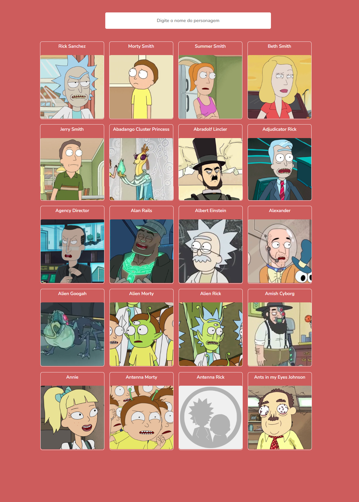

## Nossas tarefas

- Criar o html incluindo o input e 3 cards(imagem/paragrafo)

- Criar o css e deixar minimamente parecido com o protótipo

- Consumir a API, mostrar dados no console e em seguida mapear dados na tela

- Fazer a captura do input mostrando no console e em seguida fazer o filtro funcionar atualizando na tela conforme buscado

- Subir no github

## Layout

